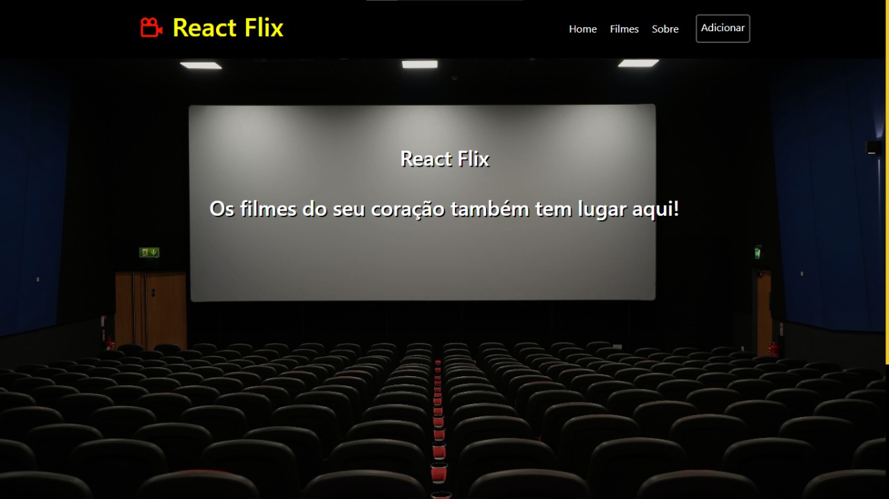
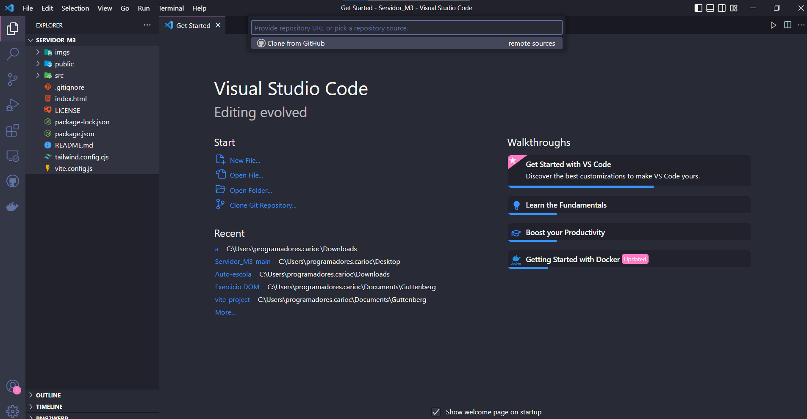
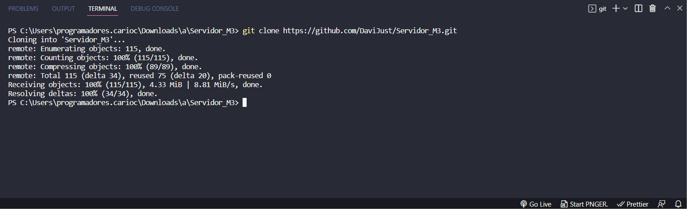

  <h1>Reactflix - Projeto em grupo número 3</h1>
    
    <h1>🟢Sobre o projeto🟢</h1>
    <h2>#Hard skills</h2>
    
O intuito do projeto é a criação de um site tematico implementando o servidor criado em um projeto individual

    <h2>#Soft skills</h2>
    
Reactflix é um site onde é criar uma biblioteca de filmes assistidos pelo usuarios e registrar suas opiniões sobre

    
   <h2>#Linguagens e Ferramentas</h2>
   
🟠Html5

   
🔵Css3

   
🟡Javascript

   
🟣React

   

   <h2>#Colaboradores</h2>
   <a href="https://github.com/BrenoRicardo">Breno Ricardo</a>
    
   <a href="https://github.com/DaviJust">Davi justino</a>
    
   <a href="https://github.com/LucasLopesPrograms">Lucas Lopes</a>
    
   <a href="https://github.com/DiegoBernardes95">Diego Bernardes</a>
    
   <a href="https://github.com/JoaoOcho">João Pedro</a>
    
   <a href="https://github.com/Hoptavio">Otavio Augusto</a>
   
<h2>Clonagem do projeto</h2>

Copie a URL do gitclone e cole no Visual studio ou no CMD

<h3>Visual Studio</h3>

 
<h3>CMD</h3>

<h2>Execução do Projeto</h2>

Após clonar o projeto, abra o terminal e use o código <strong>npm install</strong>, após isso <strong>npm run dev</strong> 

